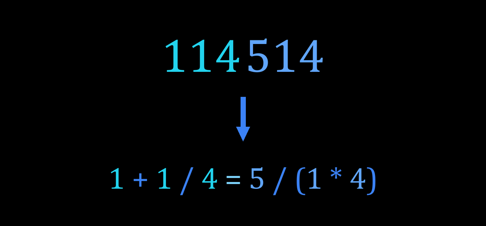

# SS 定理 / The SS Theorem

**硅基-沉默整数平衡化定理 / Silicon-Silence’s Balance Integer Theorem**



> **主定理 / Main theorem**
>
> 在十进制下，任意**大于 9989858** 的整数，都可以在其中插入加减乘除、
> 小括号与一个等号，使之成为正确的等式。
>
> Every decimal integer **greater than 9989858** can be turned into a true
> equation by inserting `+ - * /`, parentheses and one `=` into its digit
> string.

例如 / for example:


| 数字串 / digits | 等式 / equation                             |
| --------------- | ------------------------------------------- |
| `1234`          | `12=3 * 4`                                  |
| `1919810`       | `19 - 1=9 + 8 + 1 + 0`                      |
| `222`           | `2=2=2`（弱平衡，两个等号 / weak, two `=`） |
| `113`           | 不存在 / none（不可平衡 / non-balanceable） |

本仓库包含定理结论、全部筛选数据与完整验证代码。
This repository ships the theorem statement, the full screening data and the
complete verification code.

相关链接 / Links:

- 文章 / Article: <https://apc-scienceunion.github.io/2026/07/18/%E4%B8%BA%E4%BD%95%E6%89%80%E6%9C%898%E4%BD%8D%E5%8F%8A%E4%BB%A5%E4%B8%8A%E7%9A%84%E6%95%B0%E9%83%BD%E5%8F%AF%E4%BB%A5%E5%8F%98%E4%B8%BA%E7%AD%89%E5%BC%8F%EF%BC%9F%E2%80%94%E2%80%94%E7%A1%85%E5%9F%BA-%E6%B2%89%E9%BB%98%E6%95%B4%E6%95%B0%E5%B9%B3%E8%A1%A1%E5%8C%96%E5%AE%9A%E7%90%86%E5%8F%8A%E5%85%B6%E8%AF%81%E6%98%8E%E7%AE%80%E6%98%8E%E4%BB%8B%E7%BB%8D/>
- 视频介绍 / Video: <https://www.bilibili.com/video/BV18dth6VEf9>

> **AI 使用声明 / AI Usage Statement**
>
> 请注意本项目代码与文本主体由 AI 生成，经过人工初步核查但仍需要仔细甄别内容正误。
>
> Please note that the code and text content of this project are generated by
> AI, preliminarily reviewed by humans, but still require careful verification
> of accuracy.

---

## 目录 / Contents

1. [问题与定义 / Problem and definitions](#1-问题与定义--problem-and-definitions)
2. [主要结论与数据 / Results and data](#2-主要结论与数据--results-and-data)
3. [规则说明 / Rule modes](#3-规则说明--rule-modes)
4. [快速开始 / Quick start](#4-快速开始--quick-start)
5. [脚本说明 / Scripts](#5-脚本说明--scripts)
6. [数据文件 / Data files](#6-数据文件--data-files)
7. [验证 / Verification](#7-验证--verification)
8. [目录结构 / Layout](#8-目录结构--layout)
9. [已知限制 / Known limitations](#9-已知限制--known-limitations)
10. [引用与许可 / Citation and license](#10-引用与许可--citation-and-license)

---

## 1. 问题与定义 / Problem and definitions

**中文**

给定一个不含先导零的十进制数字串 `w`，可以向其中插入 `+`、`-`、`*`、`/`、
小括号与等号（连接符 `_` 表示两数字不插符、直接拼接）：

- **插符**：在数字串中插入运算符的操作；得到的表达式之值称为**插符值**，
  所有可得到的插符值构成**插符值集** `Val(w)`（本仓库用精确有理数计算）。
- **可归零**：存在一种切分 `w = L R` 与插符，使 `w` 的插符值为 `0`
  （等价于两侧存在公共值，或其中一侧可得到 `0` 再乘到整体上）。
- **平衡化**：把 `w` 切成若干段，使各段插符值集的交集非空，即插入等号后
  成为正确等式。
  - **强平衡化**：只需两段（恰好一个等号）。
  - **弱平衡化**：需要三段及以上（多个等号）。
- **不可归零数 / 不可平衡数 / 强、弱不可平衡数**：上述性质不成立的反例。

初始问题：我们是否总能插入加减乘除、小括号与等号，让数字成为正确的等式？

**English**

Given a decimal digit string `w` without leading zeros, one may insert `+`,
`-`, `*`, `/`, parentheses and `=` signs (juxtaposition, written `_`, means no
operator is inserted):

- **Insertion**: the operation of inserting operators; the resulting expression
  values form the **value set** `Val(w)` (computed here with exact rationals).
- **Zeroable**: some cut `w = L R` and insertion yields value `0`.
- **Balancing**: cutting `w` into segments whose value sets share a common
  value, so the inserted `=` signs form true equations.
  - **Strong**: two segments (exactly one `=`) suffice.
  - **Weak**: three or more segments (multiple `=`) are needed.
- **Non-zeroable / non-balanceable / strongly or weakly non-balanceable**:
  the corresponding counterexamples.

Initial question: can we always insert `+`, `-`, `*`, `/`, parentheses and
equals signs into a digit string to make it a true equation?

---

## 2. 主要结论与数据 / Results and data

**中文**

- 不可归零串共 **2873** 个，最长 7 位，最大为 `8985898`，且它是唯一的 7 位
  不可归零串；因此 **N' = 8**：任何 8 位及以上的数字串都可归零。
- 素可归零串（本身可归零、真子串均不可归零）共 **6534** 个（含平凡串 `0`），
  最大为 `9896989`。
- 无单等号解的串共 **19515** 个（2–7 位；8–15 位候选全部可解），最大为
  `9989858`。
- 其中 **18198** 个即使允许任意多个等号也无法平衡（强不可平衡），最大仍为
  `9989858`；**1317** 个可通过多个等号平衡（弱不可平衡）。
- 结合 `N' = 8` 与 `0=0` 构造可得 `N <= 16`；候选集穷举进一步表明 8–15 位
  候选全部可解、7 位反例不超过 `9989858`。结论收紧为：**任意大于 `9989858`
  的整数均可平衡化**，而 `9989858` 本身是强不可平衡反例，下界精确。

**English**

- There are **2873** non-zeroable strings, all at most 7 digits; the largest is
  `8985898`, the unique 7-digit one. Hence **N' = 8**: every 8+ digit string is
  zeroable.
- There are **6534** prime zeroable strings (zeroable while all proper
  substrings are not; including the trivial string `0`), the largest being
  `9896989`.
- Exactly **19515** strings (2–7 digits) admit no single-`=` balancing
  (all 8–15 digit candidates do admit one); the largest is `9989858`.
- **18198** of them remain non-balanceable even with arbitrarily many `=`
  signs (strongly non-balanceable, largest `9989858`), while **1317** become
  balanceable with multiple `=` signs (weakly non-balanceable).
- Combining `N' = 8` with the `0=0` construction gives `N <= 16`; the
  candidate sweep further shows that every 8–15 digit candidate is solvable
  and that all 7-digit counterexamples are at most `9989858`. The conclusion
  tightens to: **every integer greater than `9989858` is balanceable**, while
  `9989858` itself is strongly non-balanceable — the bound is sharp.


| 数据 / data                           | 数量 / count | 最大元素 / maximum |
| ------------------------------------- | -----------: | ------------------ |
| 素可归零串 / prime zeroable           |         6534 | `9896989`          |
| 不可归零串 / non-zeroable             |         2873 | `8985898`          |
| 无单等号解 / no single-`=` solution   |        19515 | `9989858`          |
| 强不可平衡 / strongly non-balanceable |        18198 | `9989858`          |
| 弱不可平衡 / weakly non-balanceable   |         1317 | `999894`           |

### 2.1 候选集 C 与 "0=0" 模式 / The candidate set C and "0=0" patterns

**中文**

若数字串 `w` 存在切分 `w = L R` 使 `L` 与 `R` 都可归零，则 `w` 立即平衡化为
`0=0`。称这样的 `w` 含有 **"0=0" 模式**（凡有该模式的串必可平衡化）。

**候选集 C** 定义为不含 "0=0" 模式的全部数字串，它等价于如下构造形式：

```text
C = { s1_c_s2 | s1、s2 为不可归零串，c 为单个数字 }
```

（`s1` 或 `s2` 允许为空；`c` 位于开头时按整数无先导零处理，故首位 `c` 只取
1–9。）

- **C 中的串没有 "0=0"**：`s1_c_s2` 的任一子串若不跨越 `c`，则完全落在 `s1`
  或 `s2` 内从而不可归零；跨越 `c` 的子串至多只有一个（`c` 只出现一次）。
  而 "0=0" 需要两个不相交的零化子串，故不可能。
- **不含 "0=0" 的串都在 C 中**：取 `s1 = w[:i]` 为最长不可归零前缀，则
  `w[:i+1]` 可归零；若 `w[i+1:]` 也可归零便产生 "0=0"，矛盾，故
  `s2 = w[i+1:]` 不可归零。
- **证明意义**：不可平衡集 `¬E` 是 `C` 的子集——不在 `C` 中的串都含 "0=0"
  模式，因而必然可平衡化。因此只需在 `C` 中寻找反例，而 `C` 远小于全体数字
  串：按原文计数，`C_8 = 14456421`、`C_9 = 28813930`、`C_10 = 24533340`、
  `C_11 = 8388910`、`C_12 = 920140`、`C_13 = 45660`、`C_14 = 1080`，15 位
  候选退化为 `8985898_c_8985898`（其子串 `5898_c_8985` 可归零，故必然可
  平衡）；2–15 位合计约 8200 万，这正是脚本 `02` 检验的候选集。

**English**

If a digit string `w` has a cut `w = L R` with both `L` and `R` zeroable, then
`w` immediately balances as `0=0`. Such a `w` is said to contain a **"0=0"
pattern** (any string with this pattern is balanceable). The **candidate set
C** is the set of digit strings *without* a "0=0" pattern; it has the
equivalent normal form

```text
C = { s1_c_s2 | s1, s2 non-zeroable, c a single digit }
```

(`s1` or `s2` may be empty; when `c` is the first character there is no leading
zero digit, so only `c` in 1–9 is used.)

- **Strings in C have no "0=0"**: any substring of `s1_c_s2` not crossing `c`
  lies inside `s1` or `s2` and is non-zeroable; at most one substring crosses
  `c` (which occurs once). A "0=0" pattern needs two disjoint zeroable parts,
  so it cannot exist.
- **Every string without "0=0" lies in C**: take `s1 = w[:i]`, the longest
  non-zeroable prefix; then `w[:i+1]` is zeroable, and `w[i+1:]` cannot be
  zeroable (otherwise a "0=0" cut would exist), so `s2 = w[i+1:]` is
  non-zeroable.
- **Proof role**: the non-balanceable set `¬E` is a subset of `C`, because
  every string outside `C` contains a "0=0" pattern and is therefore
  balanceable. Counterexamples can only live in `C`, which is far smaller than
  all digit strings: the original counts are `C_8 = 14456421`,
  `C_9 = 28813930`, `C_10 = 24533340`, `C_11 = 8388910`, `C_12 = 920140`,
  `C_13 = 45660`, `C_14 = 1080`, and the 15-digit candidates reduce to
  `8985898_c_8985898` (it contains the zeroable substring `5898_c_8985`),
  about 82 million candidates for 2–15 digits in total — exactly the candidate
  set tested by script `02`.

---

## 3. 规则说明 / Rule modes

**中文**

- **默认模式 `segment`（与已发布数据一致）**：每个分割段的首个数词允许带
  前导负号，例如 `1433 -> (-1)+4=3=3`。这对应在段首数字前插入 `-`。
- **严格模式 `strict`（脚本加 `--strict`）**：只允许二元运算与括号，不允许前导
  负号。可以证明（并在单元测试中复核）：对长度 ≤ 4 的全部数字串，
  段首负号值集恰为严格值集的 ± 闭包；对二分割平衡判定两种模式等价，
  但**弱/强分类依赖规则**：1317 个弱串中有 412 个需要前导负号。

**English**

- **Default `segment` mode (matches the published data)**: the first number
  token of every segment may carry a leading minus, e.g. `1433 -> (-1)+4=3=3`.
- **Strict `--strict` mode**: only binary operators and parentheses; no leading
  minus. One can show (and the unit tests re-check) that for all strings of
  length ≤ 4 the segment value set equals the sign closure of the strict one;
  the two modes agree on 2-segment balanceability, but the **weak/strong split
  depends on the rule**: 412 of the 1317 weak strings need the leading minus.

---

## 4. 快速开始 / Quick start

环境 / Requirements: **Python >= 3.10**，仅标准库 / standard library only.

```bash
# 平衡化一个数字（默认现场搜索，优先二分割）/ balance a number (search first, 2 segments preferred)
python 04_balance_number.py 1919810

# 查表快速判定 / fast table lookup
python 04_balance_number.py 222 --table
python 04_balance_number.py 9989858 --table

# 重新筛选不可归零数（7 位，分钟级）/ re-run the zeroability sieve (7 digits, minutes)
python 01_sieve_zeroable.py -n 7

# 验证全部发布数据（约 30 秒）/ verify all shipped data (~30 s)
python verify_results.py

# 单元测试 / unit tests
python -m unittest discover -s tests -v
```

输出示例 / sample output:

```text
$ python 04_balance_number.py 1919810
数字 / number : 1919810
模式 / mode : segment (允许段首负号 / segment-leading minus)
结果 / result : 19 - 1=9 + 8 + 1 + 0
分割 / segments : 191 | 9810
段数 / segment count : 2, 等号 / equals : 1
公共值 / common value : 18
验证 / verification : 通过 / valid
```

```text
$ python 04_balance_number.py 9989858 --table
数字 / number : 9989858
表中判定 / table result : 强不可平衡 / strongly non-balanceable
说明 / note : 无论插入多少等号都无法构成等式 / no number of '=' can form an equation
```

```text
$ python verify_results.py
A. 数据一致性检查 / data consistency
B. 小规模全量复算（长度 <= 5，分类 <= 4）/ small-scale exhaustive recomputation
  复算条目 / recomputed: 可归零 66429, 二分割 99990, 分类 9990; 用时 / 23.8s

验证通过 / verification PASSED （共 41 项检查 / checks）
```

---

## 5. 脚本说明 / Scripts


| 脚本 / script                   | 作用 / purpose                                              | 输入 / input              | 输出 / output                                         |
| ------------------------------- | ----------------------------------------------------------- | ------------------------- | ----------------------------------------------------- |
| `sst_core.py`                   | 核心库：值集、可归零、平衡化搜索、表达式求值 / core library | —                        | —                                                    |
| `01_sieve_zeroable.py`          | 不可归零数筛选 / zeroability sieve                          | 无 / none                 | `prime_zeroable.json`, `non_zeroable.json`            |
| `02_sieve_nonbalanceable.py`    | 不可平衡数筛选 / single-`=` sieve                           | `non_zeroable.json`       | `non_balanceable.json`                                |
| `03_classify_nonbalanceable.py` | 强/弱不可平衡分类 / strong-weak classification              | `non_balanceable.json`    | `classification.json`, `strong_*.json`, `weak_*.json` |
| `04_balance_number.py`          | 手动输入平衡化 / interactive balancing                      | 命令行/REPL / CLI or REPL | 屏幕输出 / stdout                                     |
| `verify_results.py`             | 数据一致性 + 全量/小规模复算 / verification                 | `data/`                   | 报告 / report                                         |

各脚本在定理证明链条中的作用 / role of each script in the proof:

**中文**

- `01_sieve_zeroable.py`：由"可归零向上传递"引理（可归零串的任意超串可归零），
  只需逐个检验素可归零串即可筛掉全部含可归零子串的数字串；输出不可归零集并
  给出 **N' = 8**（最大不可归零数 `8985898` 只有 7 位），先把问题的位数上界
  压到 `N <= 2N' = 16`。
- `02_sieve_nonbalanceable.py`：利用候选集 `C = {s1_c_s2}`（2.1 节：`C` 恰好
  是不含 "0=0" 模式的串，而不可平衡集 `¬E ⊆ C`），把搜索空间从全体数字串
  缩小到约 8200 万；在其中检验二分割可平衡性，证明 8–15 位候选无一反例、
  7 位反例最大为 `9989858`，从而得到主定理及其精确下界。
- `03_classify_nonbalanceable.py`：对放宽为"任意多个等号"后的候选集幸存者再
  分类，证明包括 `9989858` 在内的 18198 个串为强不可平衡、其余 1317 个为弱
  不可平衡，即"多等号放宽"不改变下界。
- `04_balance_number.py`：定理的构造性体现——对任意输入现场构造并独立求值
  验证见证等式；对任意大于 `9989858` 的输入必然成功。
- `verify_results.py`：把上述结论变为可复核的检查（数据一致性、长度 ≤ 5 的
  全量独立复算、`--deep` 全量逐条复核）。

**English**

- `01_sieve_zeroable.py`: by the upward-closure lemma (superstrings of a zeroable
  string are zeroable), testing prime zeroable strings suffices to remove every
  string containing a zeroable substring. Its output yields **N' = 8** (the
  largest non-zeroable string `8985898` has 7 digits), which first bounds the
  problem by `N <= 2N' = 16`.
- `02_sieve_nonbalanceable.py`: uses the candidate set `C = {s1_c_s2}` (section
  2.1: `C` is exactly the set of strings without a "0=0" pattern, and
  `¬E ⊆ C`) to shrink the search space to about 82 million candidates. Testing
  2-cut balanceability there proves that no 8–15 digit candidate is a
  counterexample and that the largest 7-digit one is `9989858` — the main
  theorem with a sharp bound.
- `03_classify_nonbalanceable.py`: reclassifies the survivors after relaxing to
  arbitrarily many `=` signs, proving that 18198 strings (including `9989858`)
  are strongly non-balanceable while the other 1317 are weakly non-balanceable:
  the multi-`=` relaxation does not change the bound.
- `04_balance_number.py`: the constructive side of the theorem — it builds and
  independently evaluates a witness equation for any input, and always succeeds
  for inputs greater than `9989858`.
- `verify_results.py`: turns all of the above into checkable tests (data
  consistency, exhaustive independent recomputation for length ≤ 5, and a
  full entry-by-entry re-check with `--deep`).

常用参数 / common options:

```bash
# 01：位数上限 / max length
python 01_sieve_zeroable.py -n 7

# 02：仅检验不超过 15 位的候选，带断点续跑 / up to 15 digits with checkpoint
python 02_sieve_nonbalanceable.py --max-length 15 \
    --checkpoint checkpoint_sieve.json --resume

# 03：严格规则分类 / classify under the strict rule
python 03_classify_nonbalanceable.py --strict

# 04：限制段数、严格规则、JSON 输出 / segment limit, strict rule, JSON output
python 04_balance_number.py 1433 --max-segments 3
python 04_balance_number.py 1234 --json
```

`04_balance_number.py` 默认不查表、现场搜索（优先二分割，再依次增加段数），
加 `--table` 则先查 `data/classification.json`：强不可平衡串直接判定，
弱不可平衡串直接给出已收录的见证等式。
Without `--table`, `04_balance_number.py` searches from scratch (two segments
first, then more). With `--table` it consults `data/classification.json`
first: strongly non-balanceable strings are reported directly and weak ones
print their recorded witnesses.

---

## 6. 数据文件 / Data files

全部位于 `data/`，均为 UTF-8 JSON。


| 文件 / file                   | 内容 / content                                            | 条数 / count |
| ----------------------------- | --------------------------------------------------------- | -----------: |
| `prime_zeroable.json`         | 素可归零串列表（含`0`）/ list, includes `0`               |         6534 |
| `non_zeroable.json`           | 不可归零串列表 / list                                     |         2873 |
| `non_balanceable.json`        | 无单等号解的串列表 / list                                 |        19515 |
| `strong_non_balanceable.json` | 强不可平衡串列表 / list                                   |        18198 |
| `weak_non_balanceable.json`   | 弱不可平衡串列表 / list                                   |         1317 |
| `classification.json`         | `{数字串: 见证等式或 null}` / `{number: witness or null}` |        19515 |
| `manifest.json`               | 计数、最大值、规则、SHA-256 校验和 / metadata and hashes  |           — |

列表文件均按 `(长度, 字典序)` 排序且无重复；`classification.json` 中
`null` 表示强不可平衡，字符串值为形如 `2=2=2` 的见证等式（由程序独立求值
验证 / validated by an independent evaluator）。
List files are sorted by `(length, lexicographic)` and unique; `null` in the
classification marks strongly non-balanceable strings.

---

## 7. 验证 / Verification

**中文**

`verify_results.py` 提供三级验证：

1. **数据一致性**（默认）：计数、最大值、排序、集合关系、1317 条见证等式求值。
2. **小规模全量复算**（默认，长度 ≤ 5，分类 ≤ 4）：对全部数字串从零复算
   可归零性与二分割/多分割可平衡性，与发布数据逐条比对。
3. **全量复核**（`--deep`）：对 2873 不可归零串、19515 无单等号解串、
   18198 强不可平衡串逐条重算。

**English**

`verify_results.py` performs three levels of verification:

1. **Data consistency** (default): counts, maxima, ordering, set relations and
   evaluation of all 1317 witness equations.
2. **Small-scale exhaustive recomputation** (default, length ≤ 5,
   classification ≤ 4): recomputes zeroability and balanceability from scratch
   for every digit string and compares with the shipped data.
3. **Full re-check** (`--deep`): rechecks every shipped entry (2873 / 19515 /
   18198).

---

## 8. 目录结构 / Layout

```text
SS-Theorem/
├─ README.md                       # 本文档（中英双语）/ this file (bilingual)
├─ LICENSE                         # MIT
├─ requirements.txt                # 仅标准库 / standard library only
├─ sst_core.py                     # 核心库 / core library
├─ 01_sieve_zeroable.py            # 不可归零数筛选 / zeroability sieve
├─ 02_sieve_nonbalanceable.py      # 不可平衡数筛选 / single-'=' sieve
├─ 03_classify_nonbalanceable.py   # 强/弱分类 / strong-weak classification
├─ 04_balance_number.py            # 手动平衡化 / interactive balancing
├─ verify_results.py               # 验证 / verification
├─ data/                           # 全部发布数据 / shipped data
└─ tests/                          # 单元测试 / unit tests
```

---

## 9. 已知限制 / Known limitations

**中文**

- `04_balance_number.py` 对很长的数字串（如 20 位以上）可能搜索较慢；可先用
  `--table` 或限制 `--max-segments`。大于 `9989858` 的数一定存在解，但本工具
  不保证在限定时间内找到。
- 默认规则与严格规则的强/弱分类不同（见第 3 节）。
- `02` 的浮点预筛使用相对容差 `1e-12`，所有命中都会用精确有理数复核，
  最终结果精确。
- 数据只涵盖十进制与符号集 `{+, -, *, /, ()}`；任意进制或其它符号集的推广
  属于后续工作。

**English**

- `04_balance_number.py` may be slow for very long strings (20+ digits); use
  `--table` or a `--max-segments` limit. A solution always exists above
  `9989858`, but is not guaranteed to be found within a time budget.
- The weak/strong split differs between the default and strict rules (section 3).
- The float prefilter in `02` uses relative tolerance `1e-12`; every hit is
  confirmed with exact rationals, so final results are exact.
- Data cover base 10 and the symbol set `{+, -, *, /, ()}` only; other bases or
  symbol sets are future work.

---

## 10. 引用与许可 / Citation and license

**中文**

- 定理与原始数据的提出与证明：硅基飙尘葆光，
  《为何所有 8 位及以上的数都可以变为等式？——硅基-沉默整数平衡化定理及其证明
  简明介绍》，2025-11-30（原始文档与证明未包含在本仓库中）。
  - 文章 / Article: <https://apc-scienceunion.github.io/2026/07/18/%E4%B8%BA%E4%BD%95%E6%89%80%E6%9C%898%E4%BD%8D%E5%8F%8A%E4%BB%A5%E4%B8%8A%E7%9A%84%E6%95%B0%E9%83%BD%E5%8F%AF%E4%BB%A5%E5%8F%98%E4%B8%BA%E7%AD%89%E5%BC%8F%EF%BC%9F%E2%80%94%E2%80%94%E7%A1%85%E5%9F%BA-%E6%B2%89%E9%BB%98%E6%95%B4%E6%95%B0%E5%B9%B3%E8%A1%A1%E5%8C%96%E5%AE%9A%E7%90%86%E5%8F%8A%E5%85%B6%E8%AF%81%E6%98%8E%E7%AE%80%E6%98%8E%E4%BB%8B%E7%BB%8D/>
  - 视频介绍 / Video: <https://www.bilibili.com/video/BV18dth6VEf9>
- 本仓库代码与数据以 MIT 许可发布，见 `LICENSE`。

**English**

- Theorem and original data: "硅基飙尘葆光", 2025-11-30 (the original manuscript
  and proof are not included in this repository).
  - Article: <https://apc-scienceunion.github.io/2026/07/18/%E4%B8%BA%E4%BD%95%E6%89%80%E6%9C%898%E4%BD%8D%E5%8F%8A%E4%BB%A5%E4%B8%8A%E7%9A%84%E6%95%B0%E9%83%BD%E5%8F%AF%E4%BB%A5%E5%8F%98%E4%B8%BA%E7%AD%89%E5%BC%8F%EF%BC%9F%E2%80%94%E2%80%94%E7%A1%85%E5%9F%BA-%E6%B2%89%E9%BB%98%E6%95%B4%E6%95%B0%E5%B9%B3%E8%A1%A1%E5%8C%96%E5%AE%9A%E7%90%86%E5%8F%8A%E5%85%B6%E8%AF%81%E6%98%8E%E7%AE%80%E6%98%8E%E4%BB%8B%E7%BB%8D/>
  - Video: <https://www.bilibili.com/video/BV18dth6VEf9>
- Code and data are released under the MIT license, see `LICENSE`.
